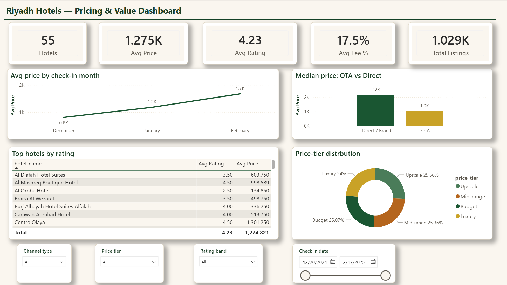
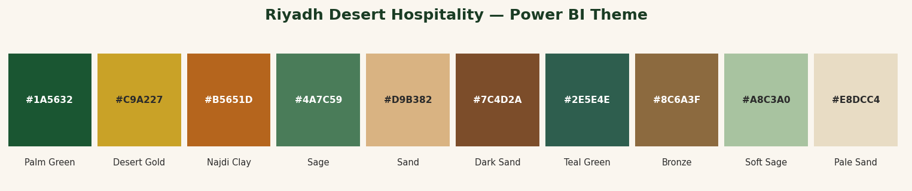

<h1 align="center">🏨 Riyadh Hotels Analysis</h1>
<p align="center"><b>Hotel Pricing & Rating Intelligence for Riyadh, Saudi Arabia</b></p>
<p align="center">Built with Python (pandas) for data preparation and Power BI for an interactive dashboard.</p>

<p align="center">
  
  
  
  
</p>

<p align="center"></p>

---

## 📑 Table of Contents

1. [Overview](#-1-overview)
2. [Questions Answered](#-2-questions-this-project-answers)
3. [Key Insights](#-3-key-insights)
4. [Dataset](#-4-dataset)
5. [Project Structure](#-5-project-structure)
6. [Data Preparation](#-6-data-preparation)
7. [How to Run](#-7-how-to-run)
8. [The Dashboard](#-8-the-dashboard)
9. [Tech Stack](#-9-tech-stack)
10. [License](#-10-license)

---

## 🔎 1. Overview

This project turns raw hotel booking data into a clear, interactive story about **how hotels in Riyadh are priced and rated** across 18 different booking channels.

The workflow has three stages:

```
Raw Excel  ──►  Python cleaning  ──►  Clean CSV  ──►  Power BI dashboard
(1,089 rows)    (scripts/clean_data.py)  (1,029 rows)   (single overview page)
```

Everything is reproducible: one script rebuilds the clean dataset from the original file, and one Power BI file visualizes it with a custom Riyadh-themed design.

---

## ❓ 2. Questions This Project Answers

- 💰 How much does a hotel room in Riyadh cost on average?
- 🏷️ Which booking source (Booking.com, Agoda, Expedia, brand sites…) is **cheapest**?
- ⭐ Does a higher price actually buy a **higher guest rating**?
- 📅 How do prices change **month to month**?
- 📍 Where are the **budget vs luxury** hotels located across the city?

---

## 💡 3. Key Insights

> These are the headline findings from the data.

| # | Insight | Evidence |
|---|---------|----------|
| 1 | **Same hotel, wildly different prices by source** | Sheraton Riyadh ranges **574 → 8,618 SAR** (a 93% gap) |
| 2 | **Direct/brand sites cost ~2.1× the OTAs** | Median **1,886 SAR** (direct) vs **712 SAR** (OTA) |
| 3 | **Prices climb sharply over time** | Avg rose **+107%**: Dec 810 → Feb 1,676 SAR — *book early* |
| 4 | **Price ≠ quality** | Price–rating correlation is weak (**0.31**) |
| 5 | **Free perks don't cost more** | Free breakfast/cancellation hotels average **1,179** vs **1,320 SAR** |
| 6 | **Best value picks** | Spectrums 603 · Shaza 755 · Joudyan 762 (rated 5.0) |

**Cheapest source overall:** Expedia (avg 266 SAR) · **Outlier:** Trip.com (avg 8,614 SAR).

---

## 📊 4. Dataset

A snapshot of Riyadh hotel listings collected from **18 booking sources** — OTAs (Booking.com, Agoda, Expedia, MakeMyTrip…) and official brand sites (Marriott, Sheraton, Fairmont, St. Regis, Hyatt, IHG…).

| Property | Value |
|----------|-------|
| Raw rows | 1,089 |
| Clean rows | 1,029 |
| Unique hotels | 55 |
| Booking sources | 18 |
| Price range | 71 – 8,618 SAR |
| Date range | 20 Dec 2024 – 17 Feb 2025 |
| Currency | Saudi Riyal (SAR) |

<details>
<summary><b>Main columns (click to expand)</b></summary>

| Column | Meaning |
|--------|---------|
| `hotel_id` | Unique identifier for each hotel |
| `hotel_name` | Name of the hotel |
| `source` | Booking source |
| `price` | Final price (base + taxes/fees) |
| `base_price` | Room price before extra fees |
| `check_in` / `check_out` | Stay dates |
| `review_count` | Number of reviews |
| `rating` | Guest rating (2.5–5.0) |
| `latitude` / `longitude` | Coordinates for mapping |

A full field-by-field reference is in [`docs/DATA_DICTIONARY.md`](docs/DATA_DICTIONARY.md).
</details>
- Source: https://www.kaggle.com/datasets/mohammedalsubaie/riyadh-hotels/data
> ℹ️ The data is used for learning and portfolio purposes only.

---

## 📁 5. Project Structure

```
riyadh-hotels-analytics/
├── data/
│   ├── raw/                  # Original Riyadh_Hotels.xlsx (untouched)
│   └── processed/            # riyadh_hotels_clean.csv (built by the script)
├── scripts/
│   └── clean_data.py         # Reproducible cleaning + feature engineering
├── powerbi/
│   └── riyadh_desert_theme.json   # Custom Power BI theme
├── docs/
│   ├── DATA_DICTIONARY.md    # Every field, explained
│   └── DASHBOARD_GUIDE.md    # Step-by-step Power BI build
├── assets/
│   ├── palette.png           # Theme color preview
│   └── dashboard_preview.png # Dashboard screenshot
├── .gitignore
└── README.md
```

---

## 🧹 6. Data Preparation

All cleaning happens in [`scripts/clean_data.py`](scripts/clean_data.py):

1. **Load** the raw Excel file with pandas.
2. **Standardize** column names (lower-case, consistent).
3. **Fix types** — convert check-in/check-out to real dates.
4. **Handle prices** — drop 60 rows with no price, fill missing `base_price`, compute `extra_fees`, add `currency = SAR`.
5. **Engineer features** — `nights`, `price_per_night`, `price_tier` (Budget→Luxury), `rating_band`, `channel_type` (OTA vs Direct/Brand), `has_free_breakfast`, `has_free_cancellation`, `has_geo`.
6. **Save** to `data/processed/riyadh_hotels_clean.csv`.

**Result:** 1,029 clean rows · 22 columns, ready for Power BI.

---

## ▶️ 7. How to Run

**Prerequisites:** Python 3.9+ and Power BI Desktop (free, Windows).

```bash
# 1. Clone the repository
git clone https://github.com/<your-username>/riyadh-hotels-analytics.git
cd riyadh-hotels-analytics

# 2. Install dependencies
pip install pandas 

# 3. Rebuild the clean dataset
python scripts/clean_data.py
```

Expected output:

```
Rows in : 1089
Dropped (no price): 60
Rows out: 1029
Unique hotels: 55
Sources: 18
```

Then open Power BI Desktop and follow [`docs/DASHBOARD_GUIDE.md`](docs/DASHBOARD_GUIDE.md).

---

## 📈 8. The Dashboard

A single, focused overview page styled with the custom **Riyadh Desert Hospitality** theme (palm green, desert gold, Najdi clay).

<p align="center"></p>

It contains:

- **5 KPI cards** — Hotels, Avg Price, Avg Rating, Avg Fee %, Listings
- **Monthly price trend** — line chart showing the +107% rise
- **OTA vs Direct** — median price comparison (2 clear bars)
- **Top hotels** — best-rated hotels table
- **Price-tier distribution** — donut chart
- **Slicers** — channel type, price tier, rating band, check-in date

Full click-by-click build steps: [`docs/DASHBOARD_GUIDE.md`](docs/DASHBOARD_GUIDE.md).

---

## 🛠️ 9. Tech Stack

| Tool | Use |
|------|-----|
| Python + pandas | Data cleaning & feature engineering |
| Power BI Desktop | Interactive dashboard |
| Custom theme JSON | Riyadh-branded visual design |

---

## 👤  10. Author

**Nawaf Alqurashi**

- [LinkedIn](https://www.linkedin.com/in/nawafqurashi)
- [GitHub](https://github.com/iNx998)


---

<p align="center">Made with 🌴 for Riyadh · data current as of Feb 2025</p>
